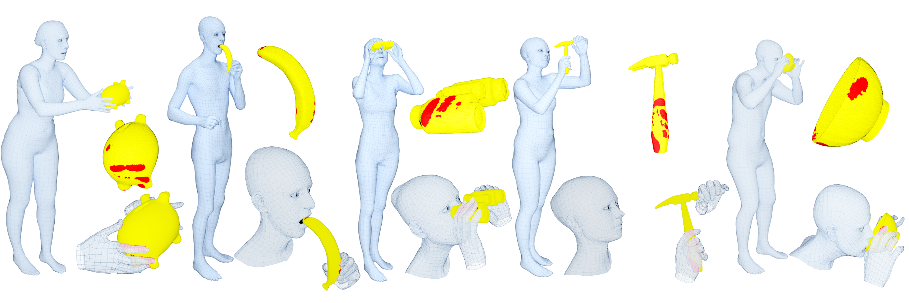
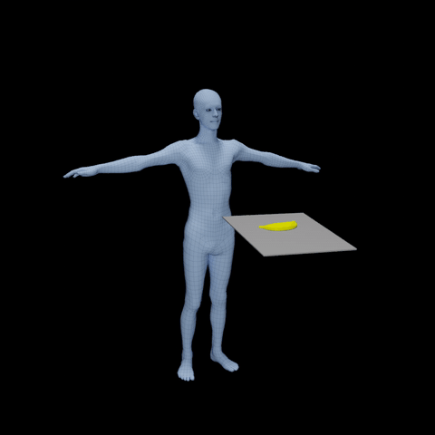
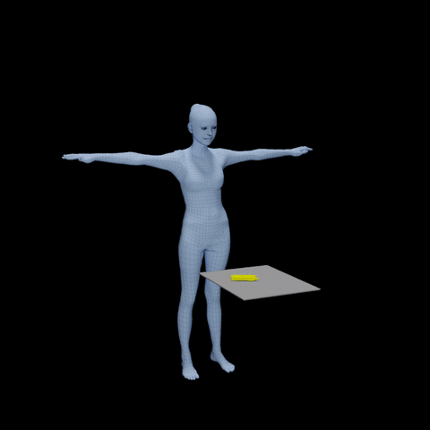
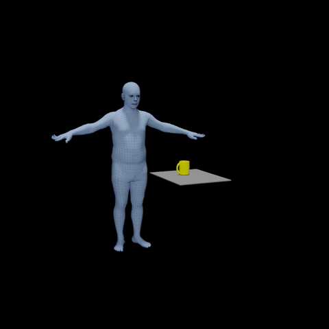
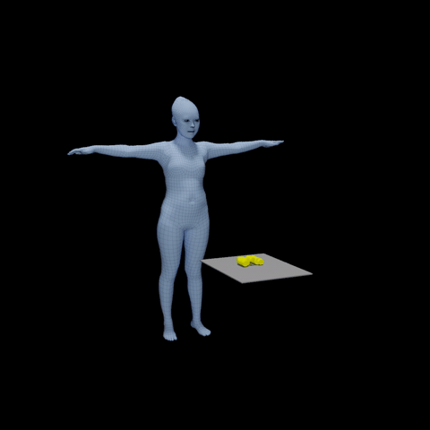
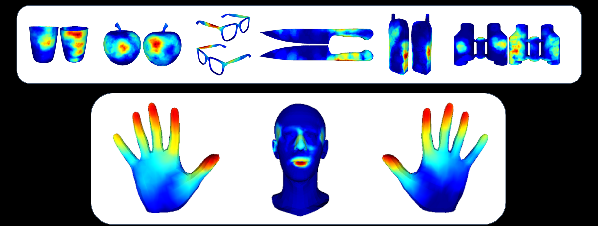
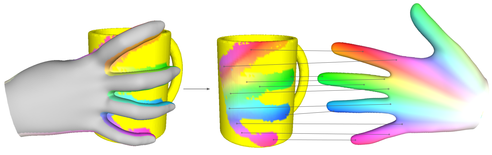
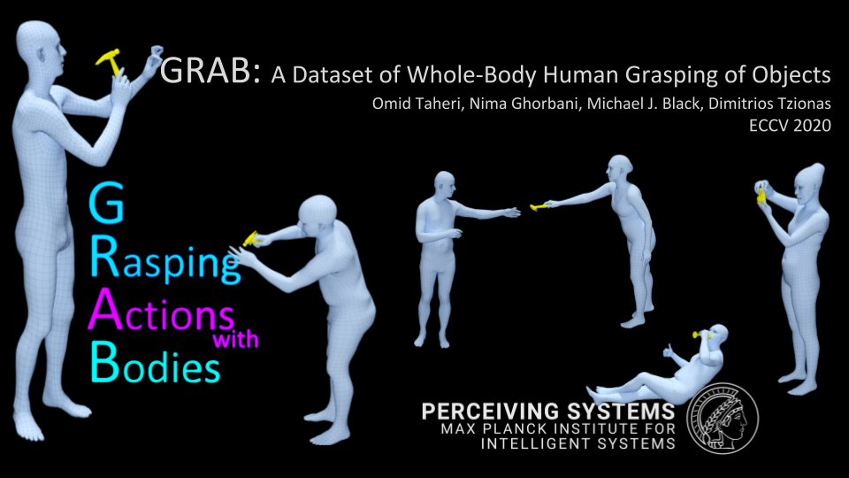
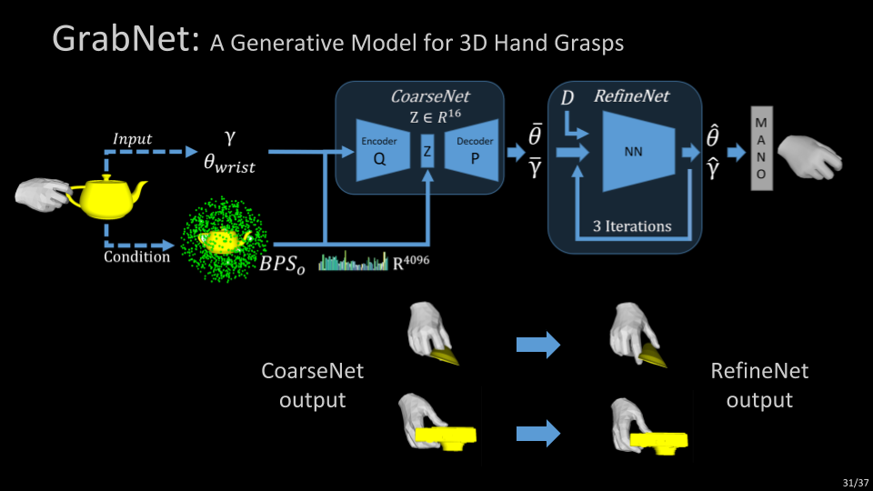
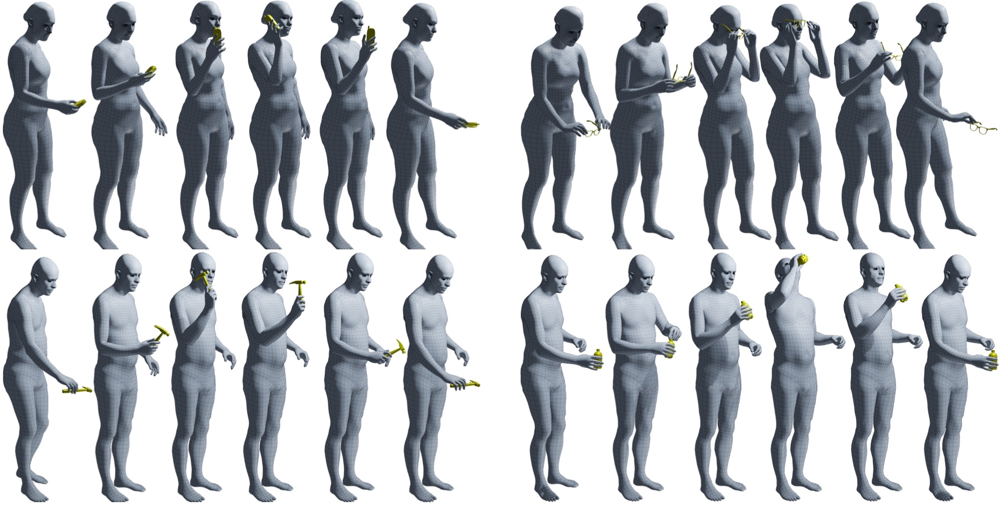

## GRAB: A Dataset of Whole-Body Human Grasping of Objects (ECCV 2020)


[](https://arxiv.org/abs/2008.11200)


[[Paper Page](https://grab.is.tue.mpg.de) ] 
[[ArXiv Paper](https://arxiv.org/abs/2008.11200) ]

[GRAB](http://grab.is.tue.mpg.de) is a dataset of full-body motions interacting and grasping 3D objects.
It contains accurate finger and facial motions as well as the contact between the objects and body. It contains 5 male and 5 female participants and 4
different motion intents.


| Eat - Banana | Talk - Phone|Drink- Mug | See - Binoculars|
| :---: | :---: |:---: | :---: |
| ||||

The GRAB dataset also contains  binary contact maps between the body and objects.
With our interacting meshes, one could integrate these contact maps over time to create
"contact heatmaps", or even compute fine-grained contact annotations, as shown below:

|Contact Heatmaps|Contact Annotation|
| :---: | :---: |
| ||


Check out the YouTube video below for more details.

| Long Video | Short Video |
| :---: | :---: |
|  [](https://youtu.be/s5syYMxmNHA) | [](https://youtu.be/VHN0DBUB4H8) |


## Table of Contents
  * [Description](#description)
  * [Requirements](#requirements)
  * [Installation](#installation)
  * [Getting Started](#getting-started)
  * [Examples](#examples)
  * [Citation](#citation)
  * [License](#license)
  * [Acknowledgments](#acknowledgments)
  * [Contact](#contact)


## Description

This repository Contains:
- Code to preprocess and prepare the GRAB data
- Tools to extract 3D vertices and meshes of the body, hands, and object
- Visualizing and rendering GRAB sequences

## Requirements
This package has the following requirements:

* [Pytorch>=1.1.0](https://pytorch.org/get-started/locally/) 
* Numpy
* Python >=3.6.0
* [smplx](https://github.com/vchoutas/smplx) 
* pyrender (for rendering and visualization)

## Installation

To install the repo please follow the next steps:

- Clone this repository and install the requirements: 
    ```Shell
    git clone https://github.com/otaheri/GRAB
    ```
    ```
    cd GRAB
    pip install -r requirements.txt
    ```

## Getting started
In order to use the GRAB dataset please follow carefully the steps below, in this exact order:

- Download the GRAB dataset (ZIP files) from [our website](http://grab.is.tue.mpg.de). Please do NOT unzip the files yet.
- Please make sure to follow the instruction on the website to get access to the **object_meshes.zip** before continuing to the next steps.
- Put all the downloaded ZIP files for GRAB in a folder.
- Run the following command to extract the ZIP files.

    ```Shell
    python grab/unzip_grab.py   --grab-path $PATH_TO_FOLDER_WITH_ZIP_FILES \
                                --extract-path $PATH_TO_EXTRACT_GRAB_DATASET_TO
    ```
- The extracted data should be in the following structure
```bash
    GRAB
    ├── grab
    │   │
    │   ├── s1
    │   └── ...
    │   └── s10
    │
    └── tools
    │    ├── object_meshes
    │    └── object_settings
    │    └── subject_meshes
    │    └── subject_settings
    │    └── smplx_correspondence
    │
    └── mocap (optional)
```
- Follow the instructions on the [SMPL-X](https://smpl-x.is.tue.mpg.de) website to download SMPL-X and MANO models.
- Check the Examples below to process, visualize, and render the data.

## Contents of each sequence

Each sequence name has the form object_action_*.npz, i.e. it shows the used object and the action. Also, the parent folder of each sequence shows the subjectID for that sequence. For example "grab/s4/mug_pass_1.npz" shows that subject "s4" passes the mug. The data in each sequence is structured as a dictionary with several keys which contain the corresponding information. Below we explain each of them separately.

- gender: The gender of the subject performing the action (male or female).

- sbj_id: The ID of each subject(s1 to s10).

- obj_name: Name of the object used in the sequence.

- motion_intent: The action which is performed by the subject on the object.

- framerate: 120 fps - fixed for all sequences.

- n_frames: The total number of frames for the sequence.

- body: We represent the body using the SMPL-X model. SMPL-X is a realistic statistical body model that is parameterized with pose, shape, and translation parameters. Using these parameters we can get the moving 3D meshes for the body. For more details please check the [website](https://smpl-x.is.tue.mpg.de/) or [paper](https://ps.is.tuebingen.mpg.de/uploads_file/attachment/attachment/497/SMPL-X.pdf). This body key contains the required data for the SMPL-X model, which are as follows:

    - params:  These are translation and joint rotations (in axis-angle representation) of the body which are required by the SMPL-X model.

    - vtemp: Gives the relative path for the file that contains the personalized shape for each subject. We pass the v-template as input to the SMPL-X model so that we get a very accurate and realistic shape and motion.

- lhand & rhand: In addition to the full-body motion, GRAB provides the data to get the motion of each hand individually. Similarly to the body, we use our MANO hand model to do this. MANO provides 3D meshes for the right and left hand given their pose and shape parameters. For more details please check our [website](http://mano.is.tue.mpg.de/) and [paper](https://ps.is.tuebingen.mpg.de/uploads_file/attachment/attachment/392/Embodied_Hands_SiggraphAsia2017.pdf). The parameters for the model are saved in the following structure:

    - params: The global translation and joint rotation (in axis-angle representation) for the hand.

    - vtemp: The relative path to the personalized shape of each hand.

- object: Each object is modeled as a rigid mesh which is rotated and translated.

    - params: Are the rotations and translations for the object during the whole sequence. 

    - object_mesh: Is the relative path to the object mesh.

- table: Each object is supported by a table at the beginning and ending of all sequences. The table is modeled as a flat surface mesh that can be rotated and translated similar to all other objects. The height of the table might be different across sequences.  The table key contains the params (similar to params for the object, see above) and relative path to the table_mesh. 

- contact: We measure the contact between the object and the body based on proximity and other criteria as described in our paper. For each motion frame, each object vertex is associated with a number that ranges from 0 to 55. 0 means there is no contact while any other number shows the specific body/hand part that the vertex has contact with. You can find the mapping between the contact number and each body joint using the table [here](https://github.com/otaheri/GRAB/blob/4dab3211fae4fc5b8eb6ab86246ccc3a42d8f611/tools/utils.py#L166).

## Examples

- #### Processing the data

    After installing the *GRAB* package and downloading the data and the models from the SMPL-X website, you should be able to run the *grab_preprocessing.py*
    
    ```Shell
    python grab/grab_preprocessing.py --grab-path $GRAB_DATASET_PATH \
                                      --model-path $SMPLX_MODEL_FOLDER \
                                      --out-path $PATH_TO_SAVE_DATA
    ```

- #### Get 3D vertices (or meshes) for GRAB
    
    In order to extract and save the vertices of the body, hands, and objects in the dataset, you can run the *get_grab_vertices.py*
    
    ```Shell
    python grab/save_grab_vertices.py --grab-path $GRAB_DATASET_PATH \
                                     --model-path $SMPLX_MODEL_FOLDER
    ```


- #### Visualizing and rendering 3D interactive meshes
    
    To visualize and interact with GRAB 3D meshes, run the *examples/visualize_grab.py*
    
    ```Shell
    python examples/visualize_grab.py --grab-path $GRAB_DATASET_PATH \
                                      --model-path $SMPLX_MODEL_FOLDER
    ```
    
    To render the meshes and save images in a folder please run the  *examples/render_grab.py*
    
    ```Shell
    python examples/render_grab.py --grab-path $GRAB_DATASET_PATH \
                                    --model-path $SMPLX_MODEL_FOLDER \
                                    --render-path $PATH_TO_SAVE_RENDERINGS
    ```


## Citation

```
@inproceedings{GRAB:2020,
  title = {{GRAB}: A Dataset of Whole-Body Human Grasping of Objects},
  author = {Taheri, Omid and Ghorbani, Nima and Black, Michael J. and Tzionas, Dimitrios},
  booktitle = {European Conference on Computer Vision (ECCV)},
  year = {2020},
  url = {https://grab.is.tue.mpg.de}
}
```

We kindly ask you to cite Brahmbhatt et al. ([ContactDB website](https://contactdb.cc.gatech.edu/)), whose object meshes are used for our GRAB dataset, as also described in our [license](./LICENSE).

## License
Software Copyright License for **non-commercial scientific research purposes**.
Please read carefully the [LICENSE file](https://github.com/otaheri/GRAB/blob/master/LICENSE) for the terms and conditions and any accompanying documentation
before you download and/or use the GRAB data, model and software, (the "Data & Software"),
including 3D meshes (body and objects), images, videos, textures, software, scripts, and animations.
By downloading and/or using the Data & Software (including downloading,
cloning, installing, and any other use of the corresponding github repository),
you acknowledge that you have read and agreed to the LICENSE terms and conditions, understand them,
and agree to be bound by them. If you do not agree with these terms and conditions,
you must not download and/or use the Data & Software. Any infringement of the terms of
this agreement will automatically terminate your rights under this [LICENSE](./LICENSE).


## Acknowledgments

Special thanks to [Mason Landry](https://ps.is.tuebingen.mpg.de/person/mlandry) for his invaluable help with this project.

We thank:
* Senya Polikovsky, Markus Hoschle (MH) and Mason Landry (ML) for the MoCap facility. 
* ML, Felipe Mattioni, David Hieber, and Alex Valis for MoCap cleaning. 
* ML and Tsvetelina Alexiadis for trial coordination, and MH and Felix Grimminger for 3D printing, 
* ML and Valerie Callaghan for voice recordings, Joachim Tesch for renderings. 
* Jonathan Williams for the website design, and Benjamin Pellkofer for the IT and web support. 
* Sai Kumar Dwivedi and Nikos Athanasiou for proofreading.

## Contact
The code of this repository was implemented by [Omid Taheri](https://ps.is.tue.mpg.de/person/otaheri).

For questions, please contact [grab@tue.mpg.de](mailto:grab@tue.mpg.de).

For commercial licensing (and all related questions for business applications), please contact [ps-licensing@tue.mpg.de](mailto:ps-licensing@tue.mpg.de).



